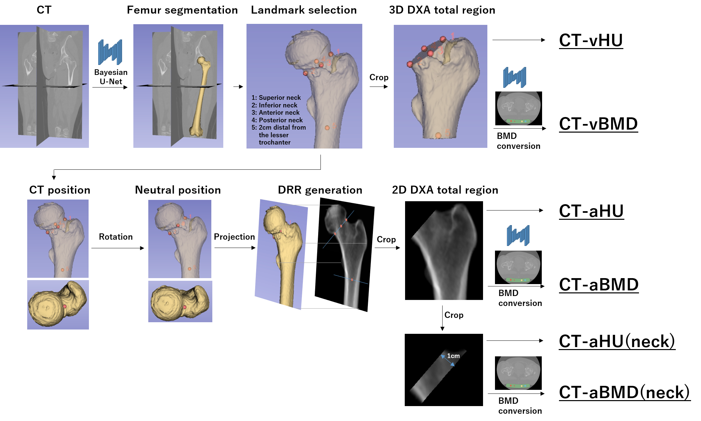

# **Calculation of proximal femur bone density**

The codes in this repository are used to quantify the 2D & 3D bone density of the proximal femur from CT images.
2D bone density of the neck region can also be measured. 



## Requirements
- MATLAB 

## Pre-processing
- Bilateral femur segmentation (Segmented by the model in https://github.com/keisuke-uemura. Model will be uploaded after the journal paper is accepted)
- Calibration phantom segmentation (If BMD conversion is needed. Segmented by models in [Phantom-segmentation](https://github.com/keisuke-uemura/CT-Intensity-Calibration-Phantom-Segmentation)

## Required input information for each case (saved in json file)
For a sample of json file, please see [sample_setup.json](/sample/sample_setup.json)
- CT images (saved as .mhd)
- Segmented label (from U-net, saved as .mhd) 
- Eight landmarks (from 3D slicer, saved as .fcsv)<dt>Head neck junction (superior, inferior, anterior, posterior)</dt> Shaft (2cm distal from the lesser trochanter, 5cm distal from the lesser trochanter)</dt>  <dt>Head center</dt> <dt>Neck center 
- Side of interest ('L' or 'R')
- Slope and intercept of the regression model (if BMD conversion is necessary. If conversion is not needed, put 0 for both parameters)

## Usage

### 2D analysis (CT-aHU and CT-aBMD)

```bash
Two_dimensional_pipeline.m
```
- Required functions <dt> mhdread.m</dt><dt>RegTools (can be downloaded from https://github.com/YoshitoOtake/RegTools)</dt>
  <dt>import_data.m</dt>
  <dt>isolate_bone_of_interest.m</dt>
  <dt>calculate_rotation_angles.m</dt>
  <dt>generate_proximal_femur_DRR.m</dt>
  <dt>select_DXA_region_DRR_label.m</dt>
  <dt>calculate_pixel_density.m</dt>

### 2D analysis (CT-aHU(neck) and CT-aBMD(neck))

```bash
Two_dimensional_pipeline_neck.m
```
- Required functions <dt> mhdread.m</dt><dt>RegTools (can be downloaded from https://github.com/YoshitoOtake/RegTools)</dt>
  <dt>import_data.m</dt>
  <dt>isolate_bone_of_interest.m</dt>
  <dt>calculate_rotation_angles.m</dt>
  <dt>generate_proximal_femur_DRR.m</dt>
  <dt>select_neck_region_DRR_label.m</dt>
  <dt>calculate_pixel_density.m</dt>


### 3D analysis (CT-vHU and CT-vBMD)
```bash
Three_dimensional_pipeline.m 
```
- Required functions <dt> mhdread.m</dt>
  <dt>import_data.m</dt>
  <dt>isolate_bone_of_interest.m</dt>
  <dt>select_DXA_region_volume_label.m</dt>
  <dt>calculate_voxel_density.m</dt>

# Licence
Codes can be used for research purpose or for educational purpose.

For details, please see [LICENCE.txt](LICENCE.txt)
